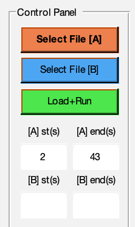

# GERMAN translation fork from PIDtoolbox
--------------------------------------------------------------------

## BAUSTELLE
Diese deutsche Übersetzung von PIDToolbox befindet sich im Aufbau und ist noch nicht vollständig übersetzt und erweitert. 
Daher bitte etwas Geduld

--------------------------------------------------------------------
Diese Deutsche Anleitung von PIDToolbox ist entstanden um Interessierten - nicht Native-English-Speaker - auf relativ einfacher Weise, die teileweisen komplexen Zusammenhänge der unterschiedlichen Filter und Auswertungsmöglichkeiten Deiner Blackbox-Logdatei mit diesem Programm zu ermöglichen.

Die Übersetzung der englischsprachigen WIKI-Seite ist nicht 1:1 und beschreibt an einigen Stellen zusätzliche Dinge, die hoffentlich das Verständnis für die Zusammenhänge innerhalb der großen Datenmengen besser zu verstehen.

Wenn Ihr Fragen/Verbesserungsvorschläge oder anderes habt, dann schreibt einen Kommentar.

Dieses Wiki ist in Absprache mit dem Owner von PIDToolBox Brian White entstanden.

Wir wünschen Euch viel Spass mit Eurem Copter, den hunderten von Möglichkeiten das Flugverhalten zu studieren, zu verbessern und die Zusammenhänge zu verstehen.

Cheers
Bernd (alias LunaX) und Brian

# PIDToolbox - Intro
PIDtoolbox ist ein Tool zur graphischen Analyse von Blackbox-Logdaten für FPV-Copter. 
Entwickelt wurde dieses eigentständige Programm zur Auswertung von Betaflight und INAV-Logdateien und ist lauffähig unter MAC OS und Windows. 

PIDToolBox ist für FPV-Hobby Piloten, die gerne herumbasteln und die bestmögliche Leistung aus seinem Copter herausholen möchten. Das Programm sollte aber auch für diejenigen, die neu in diesem Hobby sind, relativ einfach zu bedienen sein und es gibt ein detailliertes **<a href="https://github.com/bw1129/PIDtoolbox/wiki/PIDtoolbox-user-guide" target="blank">Wiki</a>**, was Dir dabei hilft die Auswertungen besser zu verstehen.

# Motivation
Die Motivation für die Entwicklung dieses Werkzeugs war die Schaffung einer benutzerfreundlichen GUI zur Analyse von Blackbox-Daten unter Verwendung einer Hochsprache mit einfachen Plot- und Visualisierungswerkzeugen, die für einen größeren Teil der FPV-Gemeinschaft leichter zugänglich sind. MATLab bietet diesbezüglich hervorragende Möglichkeiten komplexe Strukturen mit einem überschaubaren Aufwand zu analysieren und in Grafiken darzustellen.

Ein weiteres Ziel war die Entwicklung einer objektiven Methode für den Vergleich zwischen zwei Flügen. Hierzu wurde die Möglichkeit implementiert zwei Flüge (Logdaten) miteinander direkt zu vergleichen. Insbesondere können so zum Beispiel Vibrationen, Throttle-Oszillationen, Propwash usw. einfach und bequem verglichen werden, ohne das Du immer merken musst, wie die vorherigen Werte waren. 
 
Wenn du Deinen Copter optimieren musst, ändere nicht gleichzeitig mehre Einstellungen, eine anschließende Analyse wird dadurh deutlich erschwert. Durch die Möglichkeit das Du in PIDToolbox zwei Dateien miteinander vergleichen kannst, ist es sehr einfach kurze hintereinander erstellte Logdateien schnell und einfach zu betrachten und Du siehst schnell die Unterschiede und kannst entscheiden ob die Anpassungen erfolgreich waren.
 
Vibrationen an Deinem Copter können softwaretechnische oder hardwaretechnische Gründe haben. Das Problem ist, dass subjektive Voreingenommenheit zu einem echten Problem werden kann, wenn die Unterschiede zwischen den Tests subtil sind. PIDtoolbox wurde unter diesem Gesichtspunkt entwickelt, Dir diese feinen Unterschiede zu visualisieren. 
 
Im Folgenden findest Du alles, was Du benötigen, um mit PIDToolbox zu starten und Deine Logdateien zu analysieren.

# Download & Installation

**<a href="https://github.com/bw1129/PIDtoolbox/releases" target="blank">Download the latest version of PIDtoolbox.</a>** Unzippe die Datei in einem Verzeichnis Deiner Wahl. Bei der aller ersten Installation nutze  **`MyAppInstaller_web`** Ist im Package (unter **`PIDtoolbox\runtime_installation_file\`**). **64 bit only!** Mit diesem Tools wird die notwendige Matlab Runtime installiert. Das kann **einige Zeit** in Anspruch nehmen, da die MATLab-Runtime sehr groß ist. Die MATLab Runtime  enthält alle  "standalone" Libraries, die notwendig sind um mit PIDToolbox Auswertungen und Analysen durchzuführen und sie anschließend in unterschiedlichen Graphen zu visualisieren. 
Der SourceCode von PIDToolbox ist selbst in MATLab geschrieben und wurde so auch compiliert. Daraus entstand die ausführebare PIDToolbox-Applikation.

**Nochmals der Hinweis: der Download von MATLab-Runtime wird mehrere Minuten in Anspruch nehmen.**

**Bitte beachte**
Wenn du bereits MATLab Runtime installiert hast (z.B 0.95), dann musst Du die Runtime nicht nochmals installieren (aktuelle Version ist 0.97 (Stand 2020)). Du musst in dem Fall lediglich die PIDToolbox-Applikation ersetzen.

**TIPS & TRICKS**
Sehr häufig werden Fehler gemeldet, dass Log-Dateien nicht richtig geladen werden können und das es beim Start zu Abbrüchen kommt. Die meisten dieser Fehler sind damit begründet das  das**`blackbox_decode`**  Programm **nicht** im gleichen Ordner wie Deine Logdatei enthalten ist (also in dem Ordner wo Deine **`.bbl´** oder **`.bfl`** Dateien liegen)

Die **`PIDtoolbox`** Applikation findest du unter  **`PIDtoolbox\main\`** . Der Inhalt des **`main`** Ordners sollte nicht geändert/verschoben werden. PIDtoolbox nutzt **`blackbox_decode`** von <a href="https://github.com/betaflight/blackbox-tools" target="blank">Betaflight/Cleanflight Blackbox Tools</a>, und ist im Download von PIDToolbox enthalten. 

**`blackbox_decode`**  ist für die Decodierung  der binären Logdatei zuständig.

* PIDtoolbox läuft unter  Windows7/8/10 64bit Maschinen und Mac 10.11 (El capitan), 10.13 (Sierra) , 10.14 (Mojave) und 10.15 (Catalina). Wenn Du Probleme hast MATLAb-Runtime oder mit PIDtoolbox, bitte Poste Dein Issue (in englisch)
**<a href="https://github.com/bw1129/PIDtoolbox/issues" target="blank">feedback here</a>** 
oder auf Facebook 
**<a href="https://www.facebook.com/groups/291745494678694/?ref=bookmarks" target="blank">Betaflight BlackBox Log Review Facebook group</a>** für Betaflight spezifische Dinge, 
rund um INAV kannst Du unter **<a href="https://www.facebook.com/groups/INAVOfficial/?ref=bookmarks" target="blank">INAV official Facebook group</a>** Hilfe finden.

* Wenn Du MATLab installiert hast und alle notwendigen Tools ebenfalls verfügbar sind, dann kannst du einfach den Sourcecode als ZIP herunterladen ( **<a href="https://github.com/bw1129/PIDtoolbox/releases" target="blank">releases</a>** herunterladen. Dies beinhaltet die aktuellesten Versionsstände von PID-Toolbox und kann aus dem Terminal heraus gestartet werden (Für MATLab Kenner ;-) )

### Disclaimer
Im Prinzip ist es kein Problem wenn Deine Logdateien irgendwo in einem Verzeichnis auf Deinem Computer liegen, hauptsache das **`blackbox_decode`** Programm ist im gleichen Ordner.

Im Interesse davon, dass weniger **Issues** gemeldet werden, bitten wir Euch, immer daran zu denken. 
**`An dem Platz wo Deine Logdateien liegen - muss auch blackbox_decode liegen`**

# Quick Guide

Für detaillierte Informationen und tiefergehende Informationen schau Dir bitte unser WIKI an
**<a href="https://github.com/mrRobot62/PIDtoolbox/wiki/" target="blank">PIDtoolbox Wiki page</a>**.

## Schnellstart

* **<a href="https://github.com/bw1129/PIDtoolbox/releases" target="blank">PIDtoolbox</a>** (versions 0.2 onward) liest **`.bbl`** oder **`.bfl`** Logdateien direkt und dekodiert diese mittels **`blackbox_decode`** <a href="https://github.com/betaflight/blackbox-tools" target="blank">(Betaflight/Cleanflight Blackbox Tools)</a> und konvertiert diese in **`.csv`** Dateien. Kopiere immer **`blackbox_decode`** in den gleichen Ordner indem auch Deine Logdateien liegen.

* Starte nun **PIDtoolbox** und lade eine Logdatei (A) oder zwei Logdateien (A+B) über die Buttons **`select file (A) oder select file(B)`** und klicke anschließend auf den Button **`load+run`**

**ACHTUNG für MAC-User**
Beim Start von PIDtoolbox wird **kein** Splashscreen angezeigt, das verwirrt den ein oder anderen, sei einfach geduldig. Im Hintergrund wird trotzdem das Programm gestartet und öffnet sich sobald alls fertig geladen ist.

* Brian empfiehlt das Du Logdatein mit einer Auflösung von 2k erstellst, das setzt aber vorauss, dass die LOOP-Rate für Deinen FC entsprechend auch einstellst. Bitte logge nicht über 4k, denn das erhöht deutlich die Verarbeitung der Daten.

Hast Du (z.B. Hardwarebedingt) eine PID-Looprate von 1k, dann musst du auch in 1k die Logdateien erzeugen.

* Um allgemeine Blackbox-Auswertungen zu erstellen, konfiguriere in bitte so, dass der Debug-Mode **`GYRO_SCALED`** ausgewählt ist. Dieser Debug-Mode enthält auch die ungefilterten GYRO-Daten die für die graphische Auswertung "gefiltert vs. ungefiltert" notwendig sind (Spektrogramme).
Wenn Du die neuen RPM-Filter in BF 4.x verwendest, dann erkennt PIDtoolbox ab Version > 0.2 den Debug-Mode **`DSHOT_PRM_TELEMETRY`** und erzeugt Graphen bezogen auf RPM-Daten bezogen auf die Motor Signale.

**`bitte beachte`**, jenachdem welchen Debug-Mode du für Deine Logdatei eingestellt hast, dementsprechend werden auch unterschiedliche Logdaten erzeugt und angezeigt und entsprechend in der Variablen "gyro unfiltered" angezeigt.

Eine Liste der möglichen Debug-Modes findest du hier:  **<a href="https://github.com/betaflight/betaflight/wiki/Debug-Modes" target="blank">Betaflight debug modes wiki</a>**.

# Danksagungen (von Brian White)
Ich muss einen längst überfälligen Dank für mehrere Personen aussprechen, die außerhalb von GitHub zu diesem Projekt beigetragen haben. 

**Mark Spatz (UAVtech)** ist für mich im Allgemeinen eine riesige Informationsquelle gewesen, und es waren die Gespräche mit ihm, die die Entwicklung dieses Tools überhaupt erst motiviert haben. 

**Chris Thompson (ctzsnooze)** hat das Projekt immer unterstützt und bringt weiterhin großartige Ideen ein, die kontinuierlich in verschiedene Revisionen der Tools integriert werden.

**DusKing** konvertierte die Tooltips in vereinfachtes Chinesisch und pflegte und kompilierte diese Version für chinesische Benutzer. 

Viele andere haben Gedanken und Ideen beigesteuert, die auf diese Weise in verschiedene Versionen der Software eingeflossen sind, von denen ich einige nur unter ihrem Namen Slack oder Github kenne: 

**Qopter, Qratz, Zach Young, Zak Smiley, Stephen Wright, McGiverGim, Bizmar, Martin Hapl, Ken Kammerer, Paweł Spychalski**. 

Ich werde diese Liste weiter aktualisieren. 

Vielen Dank für Ihre Hilfe!

Ich hoffe Du findest PIDtoolbox nützlich und ich freue mich über ein Feedback aus der FPV-Community
Cheers! -Brian

